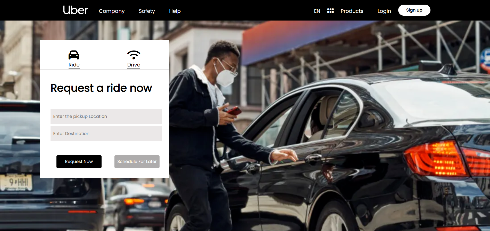

<div align="center">

# 🚗 UBER LANDING PAGE CLONE
### *High-Fidelity UI Replication with HTML & CSS*

[](https://developer.mozilla.org/en-US/docs/Web/HTML)
[](https://developer.mozilla.org/en-US/docs/Web/CSS)

**A pixel-perfect recreation of the Uber homepage, focusing on corporate branding, clean typography, and layout precision.**
</div>

---

## 📖 Overview
The **Uber Clone** project was developed to practice advanced CSS layout techniques. Replicating a world-class interface like Uber's requires a deep understanding of alignment, spacing, and visual hierarchy. This project serves as a showcase of my ability to build professional-grade static pages from scratch.

---

## 📸 Preview
<div align="center">
  
</div>

Note: Since this is a static project, buttons and links are for visual representation only.

---

## ✨ Key Technical Features
* **🖤 Brand Aesthetic:** Replicated Uber’s iconic black-and-white color palette and minimalist design language.
* **📱 Responsive Grid:** Implemented a flexible grid system to ensure the layout adapts to various screen dimensions.
* **🔗 Navigation Logic:** Recreated the complex header and sub-navigation menus found on the original site.
* **🖼️ Asset Optimization:** Managed and implemented high-quality imagery to match the premium feel of the platform.

---

## 🛠️ Tools & Technologies
* **Language:** HTML5 (Semantic Structure)
* **Styling:** CSS3 (Flexbox & Custom Transitions)
* **Design Pattern:** Component-based styling for reusable UI elements.

---


## 🚦 How to Run
This is a static frontend project. No build process is required.
1. **Clone the repository:**
   ```bash
   git clone [https://github.com/faizal08/UBER-CLONE.git](https://github.com/faizal08/UBER-CLONE.git)
---
2. Open index.html in any modern web browser.

---

## 📧 Contact
- *Developer:* [Faizal](https://github.com/faizal08)
- *Email:* [reachfaizal08@gmail.com](mailto:reachfaizal08@gmail.com)
